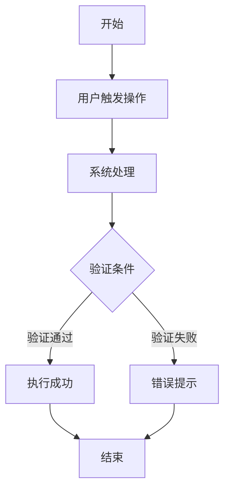

# 优化查询接口性能

<!-- 
文档生成信息:
- 使用 Skill: prd-document
- 生成工具: requirement_followup.py
- 生成时间: 2026-03-21 14:01
- 文档编号: PRD-20260321-查询接口性能
-->

> **声明：** 本文档使用 `prd-document` skill 生成  
> **状态：** 需求分析中  
> **创建日期:** 2026-03-21  
> **需求人:** 梁思洁  
> **文档版本:** v1.0

---

## 1. 背景与目标

### 1.1 背景（为什么要做？解决什么问题？）
在使用系统过程中，发现优化查询接口性能的功能不够完善，需要改进以提升工作效率。

### 1.2 目标用户
业务部门和运营团队日常使用

### 1.3 业务目标
- 解决用户当前面临的核心痛点
- 提升业务处理效率和用户体验
- 降低人工操作成本和错误率

---

## 2. 现状

### 2.1 当前系统/流程现状
用户目前需要手动导出数据，然后在Excel中进行处理，步骤繁琐

### 2.2 存在的问题
目前流程繁琐，耗时较长，影响工作效率

---

## 3. 目标（要达到什么效果？）

### 3.1 产品目标
实现优化查询接口性能的自动化处理功能，减少人工操作

---

## 4. 方案

### 4.1 流程图

### 4.2 功能说明
实现优化查询接口性能的自动化处理功能，减少人工操作

---

## 5. 优先级和时间计划

- **优先级**: 中等优先级，希望在两周内完成
- **期望上线时间**: 根据优先级确定

---

## 6. 附件与参考资料

无

---

*本文档由需求跟进系统基于 prd-document skill 自动生成*
