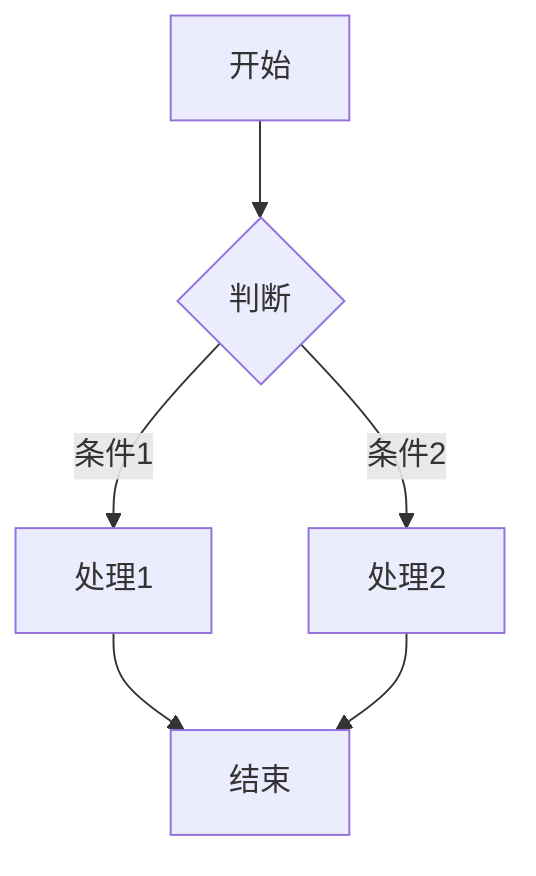
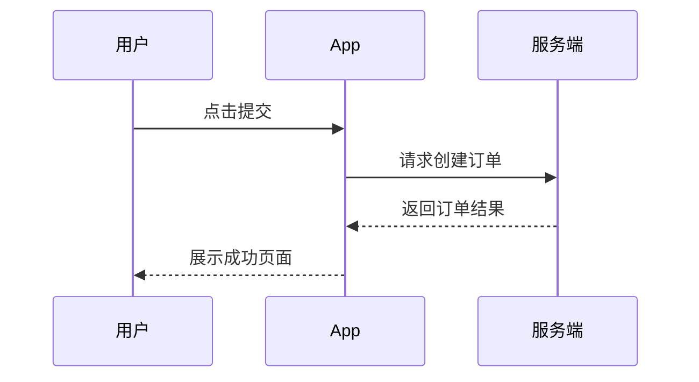

# 产品需求规划

## 概述

撰写全面的产品需求文档（PRD），确保团队对功能目标、用户价值、验收标准有清晰共识。专注于"做什么"和"为什么"，而非"怎么做"。

**适用场景：**
- 新功能规划
- 产品迭代
- 需求评审准备

**声明开头：** "我正在使用产品需求规划技能来创建 PRD。"

**文档保存路径：** `docs/prd/YYYY-MM-DD-<feature-name>.md`

---

## PRD 文档模板

```markdown
# [功能名称] 产品需求文档

> **状态：** 草稿 / 评审中 / 已批准  
> **负责人：** @产品经理  
> **日期：** YYYY-MM-DD  

---

## 1. 背景与目标

### 1.1 背景
[为什么要做这个功能？解决了什么问题？]

### 1.2 目标
| 目标类型 | 描述 | 指标 |
|---------|------|------|
| 业务目标 | [如：提升转化率] | [如：提升 15%] |
| 用户目标 | [如：减少操作步骤] | [如：步骤从 5 步减到 3 步] |

---

## 2. 用户故事

### 2.1 目标用户
- **主要用户：** [用户画像]
- **使用场景：** [场景描述]

### 2.2 用户故事
```
作为 [用户角色]
我希望 [功能/能力]
以便 [价值/收益]
```

**故事列表：**
| ID | 用户故事 | 优先级 |
|----|---------|-------|
| US-01 | 作为新用户，我希望快速注册，以便立即使用产品 | P0 |
| US-02 | 作为老用户，我希望保存购物车，以便下次继续购买 | P1 |

---

## 3. 功能需求

### 3.1 功能清单

| 功能模块 | 功能点 | 优先级 | 用户故事 | 备注 |
|---------|-------|--------|---------|------|
| 模块A | 功能点1 | P0 | US-01 | 核心功能 |
| 模块A | 功能点2 | P1 | US-02 | 体验优化 |
| 模块B | 功能点3 | P2 | US-03 | 增值功能 |

### 3.2 优先级定义
- **P0（必备）：** 没有这个功能，产品无法发布
- **P1（重要）：** 显著提升用户体验，可在后续迭代补充
- **P2（期望）：** 锦上添花，资源允许时再做

---

## 4. 竞品分析

### 4.1 竞品对标
| 功能 | 我们 | 竞品A | 竞品B | 差异化策略 |
|------|-----|------|------|-----------|
| 功能X | 无 | 有 | 有 | [计划如何差异化] |
| 功能Y | 有 | 无 | 有 | [现有优势] |

### 4.2 竞品截图/体验
[放置竞品功能截图或体验记录]

---

## 5. 验收标准

### 5.1 功能验收标准

| 功能点 | 验收标准 | 测试方法 |
|-------|---------|---------|
| 注册流程 | 用户能在30秒内完成注册 | 用户测试 |
| 支付功能 | 支付成功率 > 99% | 数据监控 |

### 5.2 通用验收标准
- [ ] 功能符合用户故事描述
- [ ] 通过 QA 测试
- [ ] 设计师验收 UI/UX
- [ ] 无阻塞性 Bug

---

## 6. 数据指标与成功标准

### 6.1 北极星指标
[最核心的成功指标，如：日活跃用户数]

### 6.2 关键指标

| 指标 | 当前值 | 目标值 | 测量方式 |
|------|-------|-------|---------|
| 指标A | 100 | 150 | 数据分析 |
| 指标B | 5% | 8% | A/B测试 |

### 6.3 成功标准
- 功能上线后 2 周内达到目标值的 80%
- 用户满意度评分 >= 4.0/5.0

---

## 7. 风险评估

| 风险 | 可能性 | 影响 | 缓解措施 |
|------|-------|------|---------|
| 需求变更频繁 | 中 | 高 | 冻结 P0 需求，建立变更流程 |
| 技术复杂度超预期 | 中 | 高 | 提前技术预研，设置技术检查点 |
| 上线时间延期 | 高 | 中 | 预留缓冲时间，准备 P0-only 方案 |
| 用户反馈不佳 | 低 | 高 | 灰度发布，快速迭代 |

---

## 8. 迭代规划

### 8.1 版本规划

| 版本 | 范围 | 时间 | 交付物 |
|------|------|------|-------|
| MVP | P0 功能 | 2周 | 可用原型 |
| V1.0 | P0+P1 | 4周 | 正式版本 |
| V1.1 | P2 功能 | 6周 | 完整版本 |

### 8.2 里程碑

- [ ] **M1 - 需求评审：** PRD 定稿，团队对齐
- [ ] **M2 - 设计完成：** UI/UX 设计稿确认
- [ ] **M3 - 开发完成：** 功能开发完毕，测试通过
- [ ] **M4 - 上线发布：** 灰度/全量上线

---

## 9. 其他说明

### 9.1 相关文档
- [原型链接]
- [数据分析报告]
- [用户调研报告]

### 9.2 依赖关系
- 依赖功能A [链接]
- 需要设计资源 @设计师
- 需要后端支持 @后端负责人

### 9.3 附录
[其他补充信息]
```

---

## PRD 生成规范

### 1. 文件创建规范

在创建 PRD 文档前，先执行以下检查：

1. **确认产品线目录**：检查 `docs/prd/` 下是否存在对应的产品线目录（如 `docs/prd/app/`, `docs/prd/backend/`）
2. **创建目录**：若目录不存在，先创建产品线目录，再创建 PRD 文件
3. **文件命名规范**：`docs/prd/<product-line>/YYYY-MM-DD-<feature-name>.md`

**示例：**
```bash
# 确认目录存在
ls docs/prd/app/

# 目录不存在时创建
mkdir -p docs/prd/app

# 创建 PRD 文件
touch docs/prd/app/2024-01-15-user-profile-v2.md
```

---

### 2. PRD 生成流程

#### 2.1 前置确认（关键步骤）

在撰写 PRD 前，必须与用户确认：

| 确认项 | 问题示例 | 处理原则 |
|-------|---------|---------|
| 已实现功能 | "登录功能是否已完成？" | 已实现的**不写**入 PRD |
| 复用模块 | "用户体系是否需要新建？" | 可复用的标记为依赖 |
| 存量数据 | "历史订单数据如何处理？" | 明确数据迁移或兼容策略 |
| 接口现状 | "是否有现成的支付接口？" | 已有接口直接引用 |

**为什么要确认？** 避免文档冗余，聚焦本次需求的核心变更点。

#### 2.2 PRD 标准结构

```
PRD 文档
├── 背景          → 为什么要做这个需求？
├── 现状          → 当前系统/流程是什么样？
├── 目标          → 要达到什么效果？
└── 方案          → 如何实现？
    ├── 流程图/时序图
    ├── 流程说明
    ├── 架构图/功能结构图
    └── 方案/功能说明
```

**各部分写作要点：**

| 章节 | 核心内容 | 禁止写入 |
|-----|---------|---------|
| 背景 | 业务痛点、市场机会、用户反馈 | 技术术语 |
| 现状 | 当前流程、现有功能、存在问题 | 解决方案 |
| 目标 | 可衡量的业务目标、用户价值 | 实现步骤 |
| 方案 | 产品设计、交互逻辑、业务规则 | 技术实现细节 |

⚠️ **禁止内容**：数据库设计、API 详细定义、代码逻辑、技术选型等技术实现细节

#### 2.3 图表规范

**使用 Mermaid 语法绘制图表：**

```markdown
## 流程图



## 时序图


```

**图表规范：**
- 子标题**不带** `**` 加粗（如写 `## 流程图` 而非 `## **流程图**`）
- 飞书文档中使用代码块（`block_type: 14`）插入 mermaid
- 流程图需覆盖主流程和异常分支
- 时序图需标明参与者和关键数据传递

---

### 3. 内容要求

#### 3.1 突出核心重点

每份 PRD 必须明确回答：
- **这次需求的核心是什么？**（用一句话概括）
- **与上次迭代的差异点在哪里？**
- **最大的风险点是什么？**

#### 3.2 使用具体案例

用具体案例描述需求逻辑，避免抽象描述。

**❌ 错误示例（过于抽象）：**
> 系统需要支持订单取消功能。

**✅ 正确示例（具体案例）：**
> **案例：用户误下单后的取消流程**
> 
> 张三在电商平台下单购买手机后，发现选错了颜色（选了黑色但想要白色）。他需要在支付前取消该订单并重新下单。
> 
> **业务规则：**
> 1. 未支付订单：用户可直接取消，库存自动释放
> 2. 已支付未发货：用户申请取消，需商家确认后退款
> 3. 已发货订单：不支持取消，需走退货流程

---

### 4. 需求变更检查清单（⚠️ 极其重要）

当需求发生变更时，必须执行以下检查步骤：

#### 4.1 检查步骤

**① 列出完整影响范围清单**

变更前，先列出所有可能受影响的内容：

| 检查维度 | 检查项 |
|---------|-------|
| 流程 | 主流程、分支流程、异常流程 |
| 页面 | 相关页面、弹窗、提示 |
| 数据 | 数据模型、字段、状态定义 |
| 规则 | 业务规则、计算逻辑、校验规则 |
| 角色 | 各角色的权限和操作 |
| 外部 | 第三方接口、回调、通知 |

**② 逐项检查并更新**

针对每个检查项，确认是否需要更新：
- [ ] 文档描述是否需要修改？
- [ ] 流程图是否需要重绘？
- [ ] 状态定义是否需要调整？
- [ ] 验收标准是否需要补充？

**③ 交叉验证一致性**

| 验证维度 | 验证内容 |
|---------|---------|
| 文字 ↔ 流程图 | 文档描述与流程图节点是否一致？ |
| 不同角色端 | 用户端、商家端、运营端逻辑是否对齐？ |
| 状态定义 ↔ 使用 | 状态定义与实际使用场景是否匹配？ |
| 正向 ↔ 异常 | 主流程与异常分支是否完整？ |

#### 4.2 常见关联内容清单

变更以下类型需求时，特别注意关联内容：

| 变更类型 | 必查关联项 |
|---------|-----------|
| 新增状态 | 状态流转图、状态变更触发条件、各端展示逻辑 |
| 修改字段 | 接口文档、数据库文档、校验规则、展示逻辑 |
| 调整流程 | 时序图、参与方职责、异常处理、通知触发 |
| 权限变更 | 角色权限矩阵、各端功能入口、数据可见范围 |
| 接口调整 | 调用方适配、版本兼容、降级策略 |

#### 4.3 反面案例警示

**案例 1：状态定义不一致**
> 某需求定义了订单状态：待支付、已支付、已发货、已完成。
> 但实际流程图中出现了"配送中"状态，文档中却未定义。
> 
> **后果：** 开发时产生歧义，前端展示与后端状态不匹配，导致线上 Bug。

**案例 2：只改文字不改图**
> 需求变更将"审核通过"改为"审核通过并通知用户"，但时序图未更新。
> 
> **后果：** 开发遗漏通知环节，功能上线后用户收不到通知，体验受损。

**案例 3：忽略异常分支**
> 新增支付功能时，只写了支付成功流程，未考虑支付失败、超时情况。
> 
> **后果：** 线上出现大量支付超时订单无法处理，需紧急修复。

**案例 4：多端逻辑不同步**
> C 端订单列表增加了"再次购买"按钮，但商家端订单详情页未同步该逻辑。
> 
> **后果：** 用户在商家端无法找到入口，功能使用率低下。

---

## 使用指南

### 每个部分的核心问题

| 章节 | 核心问题 |
|-----|---------|
| 背景与目标 | Why - 为什么做？要解决什么问题？ |
| 用户故事 | Who & What - 为谁做？他们需要什么？ |
| 功能需求 | What - 具体要做什么功能？优先级如何？ |
| 竞品分析 | Landscape - 竞品怎么做？我们怎么差异化？ |
| 验收标准 | Done - 怎么算完成？如何验证？ |
| 数据指标 | Success - 如何衡量成功？ |
| 风险评估 | Risk - 可能出什么问题？如何应对？ |
| 迭代规划 | When - 什么时候交付？分哪些阶段？ |

### 输出检查清单

创建 PRD 后，确认以下问题都有答案：

- [ ] 目标用户是否明确？
- [ ] 用户故事是否清晰（Who-What-Value）？
- [ ] 功能优先级是否合理（P0/P1/P2）？
- [ ] 验收标准是否可测试？
- [ ] 成功指标是否可量化？
- [ ] 风险是否已识别并有缓解方案？
- [ ] 时间规划是否合理（含缓冲）？

---

## 后续流程

PRD 完成后，进入以下环节：

```
PRD 完成 → 需求评审 → 设计输出 → 技术方案 → 开发 → 测试 → 上线
```

**下一步选项：**
1. **召集需求评审会议** - 邀请设计、开发、测试参与
2. **细化技术方案** - 与技术负责人对接，输出技术方案
3. **制定项目计划** - 使用 project-planning 技能制定详细项目计划

**提示：** PRD 是活的文档，在开发过程中根据反馈持续更新。
